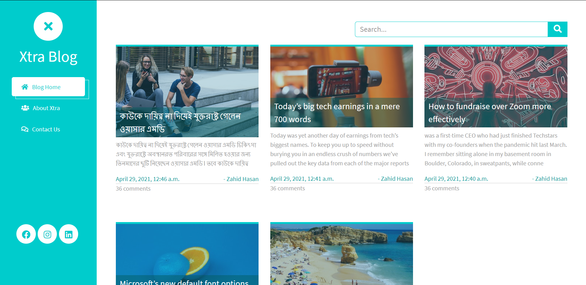

<div align="center" id="top"> 
  

&#xa0;

  <!-- <a href="https://xtra_blog.netlify.app">Demo</a> -->
</div>

<h1 align="center">Xtra_blog</h1>

<p align="center">
  

  

  

  

  <!--

  -->

  
</p>

 <h4 align="center">
	🚧  Xtra_blog 🚀 Under construction...  🚧
</h4>

<hr>

<p align="center">
  <a href="#dart-about">About</a> &#xa0; | &#xa0; 
  <a href="#sparkles-features">Features</a> &#xa0; | &#xa0;
  <a href="#rocket-technologies">Technologies</a> &#xa0; | &#xa0;
  <a href="#white_check_mark-requirements">Requirements</a> &#xa0; | &#xa0;
  <a href="#checkered_flag-starting">Starting</a> &#xa0; | &#xa0;
  <a href="#memo-license">License</a> &#xa0; | &#xa0;
  <a href="https://github.com/Druvo" target="_blank">Author</a>
</p>

<br>

## :dart: About

This is a test project to do some experiment and learn!!!

## :sparkles: Features

:heavy_check_mark: User management;\
:heavy_check_mark: Blog Post management;\
:heavy_check_mark: Contract;

## :rocket: Technologies

The following tools were used in this project:

- [Django 3.2](https://djangoproject.com/)
- [python 3](https://www.python.org/)
- [pip 21.1](https://pypi.org)
- [asgiref 3.3.4](https://pypi.org)
- [pytz 2021.1](https://pypi.org)
- [sqlparse 0.4.1](https://pypi.org)
- [Github](https://pypi.org)

## :white_check_mark: Requirements

Before starting :checkered_flag:, you need to have [Git](https://git-scm.com), [python](https://python.org/) and [Django](https://www.djangoproject.com/) installed.

## :checkered_flag: Starting

```bash
# Clone this project
$ git clone https://github.com/Druvo/xtra_blog

# Access
$ cd xtra_blog

# Install dependencies
$ pip install -r requirements.txt

# Run the project
$ python manage.py runserver

# The server will initialize in the <http://localhost:8000>
```

## :memo: License

This project is under license from MIT. For more details, see the [LICENSE](LICENSE.md) file.

Made with :heart: by <a href="https://github.com/Druvo" target="_blank">Druvo</a>

&#xa0;

<a href="#top">Back to top</a>
